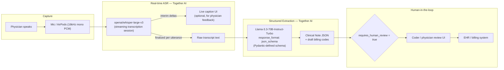
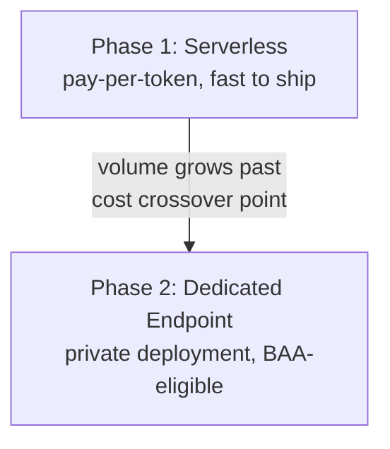

# Architecture

## Deployment phasing

## Design principles

1. **Two-model pipeline, not one model doing everything.** ASR (Whisper) transcribes speech; a separate LLM call (Llama 3.3 70B) corrects ASR artifacts, structures the note, and drafts billing codes. Whisper has no concept of JSON schemas — structuring belongs in the LLM layer.
2. **Schema-constrained JSON, not "please output JSON" prompting.** `response_format: json_schema` (backed by a Pydantic model) guarantees the LLM's output matches our exact schema — no parsing failures in production.
3. **Billing codes are always drafts.** Every response includes `requires_human_review: true` — this is a compliance/liability boundary, not a UX detail. No code reaches the billing system without a certified coder sign-off.
4. **Cost-phased infrastructure.** Start serverless for MVP speed; migrate to a Dedicated Endpoint once volume crosses the cost-justification line — unless PHI/BAA requirements force Dedicated from day one regardless of cost.
5. **Near-real-time via streaming + per-utterance structuring.** The LLM structuring pass runs on each finalized utterance rather than waiting for the whole visit, keeping the pipeline responsive.
